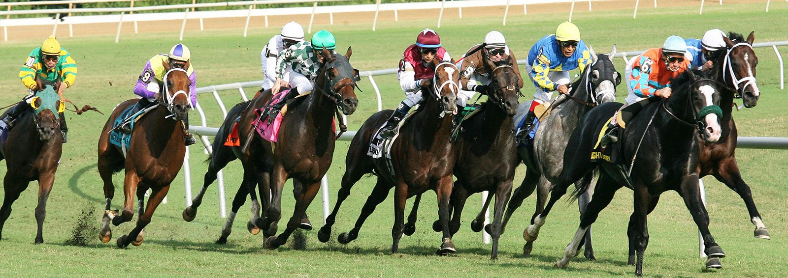

# Scrape the Web - Take a Bet



For a while now the possibilities of machine learning have fascinated me. Though I was doing some for fun on the side I 
have decided to take it more seriously. By chance, with that thought in my mind, I have came across the company [Springco](https://www.spring-co.nl/) which
uses machine learning to get answers for urban related questions. 

After an inspiring conversation with Hank Groenhof and René Neijmeijer covering topics such as the steps taken
to get to an answer, statistics, neural nets and lastly how and where to get your data. It got me thinking.  

*Questions I am going to answer*

**What specific data do you want?**  
**How do you harvest data from a website if no off the shelf API exists?**    
**How do you want to store it and in which format?**  
**How could a data scientist use the harvested data?**

Because I used to play badminton in the previous days and have scoured the [https://www.toernooi.nl](https://www.toernooi.nl/tournaments) a lot for keeping track of 
matches I thought it would be fun to use that as a base for this case. It would have saved me a lot of time then if I had a
web scraper doing all the searching for me 😃.

**The code for this demo project could be found in this [Git repo](https://github.com/leonstel/techblog_scrape_the_web)**

## Use Case - Sports Betting

Recently sport betting is becoming legal in the united states. Imagine that you are the owner of a sports club and 
wants to make some extra money. Your objective is: 

- Getting insights if betting on the tournaments held at my club is profitable

The first step to achieve this goal is to gather data related to this objective. So you figured that you should have a 
collection of **tournaments, players, games, scores and winners**. After hours maybe days of searching the web for an easy to 
consume API, which has your exact data requirements mentioned previously, you have come to the conclusion that it is a lost cause. 

Just before you are going to call it a day you come across the website [https://www.toernooi.nl](https://www.toernooi.nl/tournaments).
Which contains the exact information you need to get any answers, but it has a major drawback. It does not have a public 
API. So you have to come up with a solution to extract the data from that website involving **web scraping**.

## Solution in a Nutshell

This is the final web scraping solution which we are building up to.  

The scraper in action (sounds like a new Hollywood action blockbuster or a sequel of The Terminator).

[](http://www.youtube.com/watch?v=zhJYiblYazY "")

- Scraping and saving to the database the tournaments, its players, games and scores. **(begin - 2:06)**
- Show resulted db tables in DataGrip db viewer **(2:06 - end)**

## Learning Points

These topics will join us on our epic journey. 

- Python and effective database connections
- Interactive Web Scraping
- Database design / querying

## Get It Running

Fill in the database.ini with your own database credentials. The code project is based on
Postgres.
```
# database.ini

[postgresql]
host=localhost
database=scraping
user=postgres
password=
```

On start the code will automatically create te tables for you through the migration sql.
The main.py is the main entry point. 
```
python main.py
```

## Links
[Scrape the Web - Take a Bet](http://leonstel.github.io/blogs/scrape_the_web1)  

[Other Blog Posts](http://leonstel.github.io/)